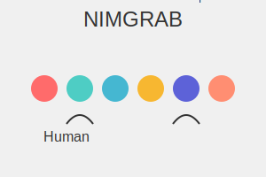

# NIMGRAB



## Description

NIMGRAB is a Python implementation of a simple two-player strategy game. Players take turns removing items from a pool, and the player forced to take the last item loses. This project showcases the use of loops, randomization, and basic AI in Python.

## Features

- Play against a computer opponent
- Randomized starting pool size (4-8 items)
- Interactive command-line interface
- Basic AI for computer moves
- Input validation for player moves

## How to Play

1. Run the script:
   ```
   python nimgrab.py
   ```

2. Choose one of the following options:
   - `p` to play the game
   - `i` to read the instructions
   - `q` to quit

3. If playing:
   - On your turn, choose 1-3 items to remove from the pool
   - The computer will then take its turn
   - The game continues until one player is forced to take the last item and loses

## Game Rules

- The game starts with a random number of items (4-8) in the pool
- Players take turns removing 1-3 items from the pool
- The player forced to take the last item loses the game

## Example Gameplay

```
Welcome to NIMGRAB!

By: Abhay Prasanna Rao

Do you want to [p]lay, [i]nstructions, or [q]uit?: p
You selected to play!
HUMAN TURN: There are 5 items left in the item pool
/////
pick a value between [1,3]: 2
2 items taken from the item pool.
///
------------------------------------------------
COMPUTER TURN: There are 3 items left in the item pool
///
2 items taken from the item pool
/
------------------------------------------------
HUMAN TURN: There are 1 items left in the item pool
/
pick a value between [1,3]: 1
1 items taken from the item pool.
You lost! Better luck next time.
```

## Author

Abhay Prasanna Rao

## Technologies Used

- Python 3
- Random module for game randomization

## Future Improvements

- Add a graphical user interface (GUI)
- Implement different difficulty levels for the AI
- Allow player vs. player mode
- Add score tracking across multiple games

## Contributions

Contributions, issues, and feature requests are welcome. Feel free to check [issues page](https://github.com/yourusername/nimgrab/issues) if you want to contribute.
